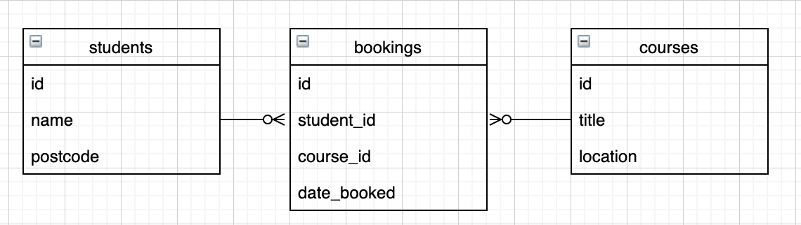

# Many To Many - Join Tables

So we've seen how we can get information from one table using a foreign key in a One to Many relationship.

We were able to get all tasks for a user by querying the tasks table and matching the `user_id` in that table to select tasks belonging to a specific user. 

But what if we don't have that direct link between tables?

What if we have multiple one to many relationships? Or a Many to Many relationship?



In the representation above a student can make many bookings and a course can have many bookings as well. The bookings table is the link between students and courses, meaning students can have many courses they're booked on and courses can be booked by many students.


Setup for this lesson

```bash
copy start_point
dropdb course_tracker
createdb course_tracker
psql -d course_tracker -f course_bookings.sql
touch queries.sql
```

## Inner Joining Multiple Tables

In our courses example, we might want to see a view that shows us a list of student names, the course they're attending and the date they booked this course. This will involve data from 3 tables.

Say for example, we wanted to view a list of all students who have booked a course or even go another step and also see which course they're attending as well.

We could do it, but we'd have to use multiple queries.

Not to panic! This is where Joins come in to play. 

## Joins

When we join data, there's a few different ways we can approach it but the one thing that really matters is that there has to be some commonality between the tables. In our case, we have the bookings table as a link between the other two tables and we can use this to do some interesting things.

With joins, we think in terms of a 'right' table and a 'left' table. These can be any table you like, but it's worth being clear in your head which one you are talking about.

We'll decide what our left and right table will be. Let's say that the left table is `students` and the right table is `bookings`.

## Let's make the magic happen

STEP ONE: Get all the columns from the left table (`students`)
```sql
-- queries.sql
SELECT students.* FROM students;
```

After each step, run your `queries.sql` file with:
```bash
psql -d course_tracker -f queries.sql
```

STEP TWO: Bring in the matches from the right table (`bookings`) given a common key to match on

```sql
-- queries.sql
SELECT students.* FROM students
INNER JOIN bookings
ON bookings.student_id = students.id;
```

So this will find, all the matching entries for the `students` in the `bookings` table i.e. every student that has a booking.

We can now think about this entire statement as being the entire left side now, that we want to bring in some more information to.

STEP THREE: Bring in the NEXT table you want to join on.

```sql
-- queries.sql
SELECT students.* FROM students
INNER JOIN bookings
ON bookings.student_id = students.id
INNER JOIN courses
ON courses.id = bookings.course_id;
```

At this point we *should* be seeing the exact same information as from the previous query.

We're still seeing the rows from students, but if there's no errors our join has been successful.

STEP FOUR: Select the data from each table you are interested in.

```sql
-- queries.sql
SELECT students.name, courses.title, bookings.date_booked FROM students
INNER JOIN bookings
ON bookings.student_id = students.id
INNER JOIN courses
ON courses.id = bookings.course_id;
```

## Additional Resources:

https://blog.codinghorror.com/a-visual-explanation-of-sql-joins/
